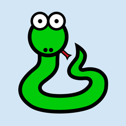

=================
Customizing icons
=================

The app we developed in the main tutorial uses a default "gray bee" icon when it
is packaged. Let's personalize this application by configuring it to use our own
icon.

Adding an icon
==============

Every platform uses a different format for application icons - and some
platforms need *multiple* icons in different sizes and shapes. To account for
this, Briefcase provides a shorthand way to configure an icon once, and then
have that definition expand in to all the different icons needed for each
individual platform.

Edit your ``pyproject.toml``, adding a new ``icon`` configuration item in the
``[tool.briefcase.app.helloworld]`` configuration section, just above the
``sources`` definition::

    icon = "icons/helloworld"

This icon definition doesn't specify any file extension. The value will be used
as a prefix; each platform will add additional items to this prefix to build the
files needed for each platform. Some platforms require *multiple* icon files;
this prefix will be combined with file size and variant modifiers to generate
the list of icon files that are used.

We can now run ``briefcase update`` again - but this time, we pass in the
``--update-resources`` flag, telling Briefcase that we want to install new
application resources (i.e., the icons):

.. tabs::

  .. group-tab:: macOS

    .. code-block:: console

      (beeware-venv) $ briefcase update --update-resources

      [helloworld] Updating application code...
      Installing src/helloworld... done

      [helloworld] Updating application resources...
      Unable to find icons/helloworld.icns for application icon; using default

      [helloworld] Removing unneeded app content...
      Removing unneeded app bundle content... done

      [helloworld] Application updated.

  .. group-tab:: Linux

    .. code-block:: console

      (beeware-venv) $ briefcase update --update-resources

      [helloworld] Updating application code...
      Installing src/helloworld... done

      [helloworld] Updating application resources...
      Unable to find icons/helloworld-16.png for 16px application icon; using default
      Unable to find icons/helloworld-32.png for 32px application icon; using default
      Unable to find icons/helloworld-64.png for 64px application icon; using default
      Unable to find icons/helloworld-128.png for 128px application icon; using default
      Unable to find icons/helloworld-256.png for 256px application icon; using default
      Unable to find icons/helloworld-512.png for 512px application icon; using default

      [helloworld] Removing unneeded app content...
      Removing unneeded app bundle content... done

      [helloworld] Application updated.

  .. group-tab:: Windows

    .. code-block:: doscon

      (beeware-venv) C:\...>briefcase update --update-resources

      [helloworld] Updating application code...
      Installing src/helloworld... done

      [helloworld] Updating application resources...
      Unable to find icons/helloworld.ico for application icon; using default

      [helloworld] Removing unneeded app content...
      Removing unneeded app bundle content... done

      [helloworld] Application updated.

  .. group-tab:: Android

    .. code-block:: console

      (beeware-venv) $ briefcase update android --update-resources

      [helloworld] Updating application code...
      Installing src/helloworld... done

      [helloworld] Updating application resources...
      Unable to find icons/helloworld-round-48.png for 48px round application icon; using default
      Unable to find icons/helloworld-round-72.png for 72px round application icon; using default
      Unable to find icons/helloworld-round-96.png for 96px round application icon; using default
      Unable to find icons/helloworld-round-144.png for 144px round application icon; using default
      Unable to find icons/helloworld-round-192.png for 192px round application icon; using default
      Unable to find icons/helloworld-square-48.png for 48px square application icon; using default
      Unable to find icons/helloworld-square-72.png for 72px square application icon; using default
      Unable to find icons/helloworld-square-96.png for 96px square application icon; using default
      Unable to find icons/helloworld-square-144.png for 144px square application icon; using default
      Unable to find icons/helloworld-square-192.png for 192px square application icon; using default
      Unable to find icons/helloworld-square-320.png for 320px square application icon; using default
      Unable to find icons/helloworld-square-480.png for 480px square application icon; using default
      Unable to find icons/helloworld-square-640.png for 640px square application icon; using default
      Unable to find icons/helloworld-square-960.png for 960px square application icon; using default
      Unable to find icons/helloworld-square-1280.png for 1280px square application icon; using default
      Unable to find icons/helloworld-adaptive-108.png for 108px adaptive application icon; using default
      Unable to find icons/helloworld-adaptive-162.png for 162px adaptive application icon; using default
      Unable to find icons/helloworld-adaptive-216.png for 216px adaptive application icon; using default
      Unable to find icons/helloworld-adaptive-324.png for 324px adaptive application icon; using default
      Unable to find icons/helloworld-adaptive-432.png for 432px adaptive application icon; using default

      [helloworld] Removing unneeded app content...
      Removing unneeded app bundle content... done

      [helloworld] Application updated.

  .. group-tab:: iOS

    .. code-block:: console

      (beeware-venv) $ briefcase iOS --update-resources

        [helloworld] Updating application code...
        Installing src/helloworld... done

        [helloworld] Updating application resources...
        Unable to find icons/helloworld-20.png for 20px application icon; using default
        Unable to find icons/helloworld-29.png for 29px application icon; using default
        Unable to find icons/helloworld-40.png for 40px application icon; using default
        Unable to find icons/helloworld-58.png for 58px application icon; using default
        Unable to find icons/helloworld-60.png for 60px application icon; using default
        Unable to find icons/helloworld-76.png for 76px application icon; using default
        Unable to find icons/helloworld-80.png for 80px application icon; using default
        Unable to find icons/helloworld-87.png for 87px application icon; using default
        Unable to find icons/helloworld-120.png for 120px application icon; using default
        Unable to find icons/helloworld-152.png for 152px application icon; using default
        Unable to find icons/helloworld-167.png for 167px application icon; using default
        Unable to find icons/helloworld-180.png for 180px application icon; using default
        Unable to find icons/helloworld-640.png for 640px application icon; using default
        Unable to find icons/helloworld-1024.png for 1024px application icon; using default
        Unable to find icons/helloworld-1280.png for 1280px application icon; using default
        Unable to find icons/helloworld-1920.png for 1920px application icon; using default

        [helloworld] Removing unneeded app content...
        Removing unneeded app bundle content... done

        [helloworld] Application updated.

This reports the specific icon file (or files) that Briefcase is expecting.
However, as we haven't provided the actual icon files, the install fails, and
Briefcase falls back to a default value (the same "gray bee" icon).

Let's provide some actual icons. Download :download:`this icons.zip bundle
<../resources/icons.zip>`, and unzip it into the root of your project
directory. After unzipping, your project directory should look something like::

    beeware-tutorial/
    ├── beeware-venv/
    │   └── ...
    └── helloworld/
        ├── ...
        ├── icons/
        │   ├── helloworld.icns
        │   ├── helloworld.ico
        │   ├── helloworld.png
        │   ├── helloworld-16.png
        │   └──...
        ├── src/
        │   └── ...
        └── pyproject.toml

There's a *lot* of icons in this folder, but most of them should look the same:
a green snake on a light blue background:

The only exception will be the icons with ``-adaptive-`` in their name; these
will have a transparent background. This represents all the different icon sizes
and shapes you need to support an app on every platform that Briefcase supports.

Now that we have icons, we can update the application again. However,
``briefcase update`` will only copy the updated resources into the build
directory; we also want to rebuild the app to make sure the new icon is
included, then start the app. We can shortcut this process by passing
``--update-resources`` to our call to ``run`` - this will update the app, update
the app's resources, and then start the app:

.. tabs::

  .. group-tab:: macOS

    .. code-block:: console

      (beeware-venv) $ briefcase run --update-resources

      [helloworld] Updating application code...
      Installing src/helloworld... done

      [helloworld] Updating application resources...
      Installing icons/helloworld.icns as application icon... done

      [helloworld] Removing unneeded app content...
      Removing unneeded app bundle content... done

      [helloworld] Application updated.

      [helloworld] Ad-hoc signing app...
           ━━━━━━━━━━━━━━━━━━━━━━━━━━━━━━━━━━━━━━━━━━━━━━━━━━ 100.0% • 00:01

      [helloworld] Built build/helloworld/macos/app/Hello World.app

      [helloworld] Starting app...

  .. group-tab:: Linux

    .. code-block:: console

      (beeware-venv) $ briefcase run --update-resources

      [helloworld] Updating application code...
      Installing src/helloworld... done

      [helloworld] Updating application resources...
      Installing icons/helloworld-16.png as 16px application icon... done
      Installing icons/helloworld-32.png as 32px application icon... done
      Installing icons/helloworld-64.png as 64px application icon... done
      Installing icons/helloworld-128.png as 128px application icon... done
      Installing icons/helloworld-256.png as 256px application icon... done
      Installing icons/helloworld-512.png as 512px application icon... done

      [helloworld] Removing unneeded app content...
      Removing unneeded app bundle content... done

      [helloworld] Application updated.

      [helloworld] Building application...
      Build bootstrap binary...
      ...

      [helloworld] Built build/helloworld/linux/ubuntu/jammy/helloworld-0.0.1/usr/bin/helloworld

      [helloworld] Starting app...

  .. group-tab:: Windows

    .. code-block:: doscon

      (beeware-venv) C:\...>briefcase build --update-resources

      [helloworld] Updating application code...
      Installing src/helloworld... done

      [helloworld] Updating application resources...
      Installing icons/helloworld.ico as application icon... done

      [helloworld] Removing unneeded app content...
      Removing unneeded app bundle content... done

      [helloworld] Application updated.

      [helloworld] Building App...
      Removing any digital signatures from stub app... done
      Setting stub app details... done

      [helloworld] Built build\helloworld\windows\app\src\Hello World.exe

      [helloworld] Starting app...

  .. group-tab:: Android

    .. code-block:: console

      (beeware-venv) $ briefcase build android --update-resources

      [helloworld] Updating application code...
      Installing src/helloworld... done

      [helloworld] Updating application resources...
      Installing icons/helloworld-round-48.png as 48px round application icon... done
      Installing icons/helloworld-round-72.png as 72px round application icon... done
      Installing icons/helloworld-round-96.png as 96px round application icon... done
      Installing icons/helloworld-round-144.png as 144px round application icon... done
      Installing icons/helloworld-round-192.png as 192px round application icon... done
      Installing icons/helloworld-square-48.png as 48px square application icon... done
      Installing icons/helloworld-square-72.png as 72px square application icon... done
      Installing icons/helloworld-square-96.png as 96px square application icon... done
      Installing icons/helloworld-square-144.png as 144px square application icon... done
      Installing icons/helloworld-square-192.png as 192px square application icon... done
      Installing icons/helloworld-square-320.png as 320px square application icon... done
      Installing icons/helloworld-square-480.png as 480px square application icon... done
      Installing icons/helloworld-square-640.png as 640px square application icon... done
      Installing icons/helloworld-square-960.png as 960px square application icon... done
      Installing icons/helloworld-square-1280.png as 1280px square application icon... done
      Installing icons/helloworld-adaptive-108.png as 108px adaptive application icon... done
      Installing icons/helloworld-adaptive-162.png as 162px adaptive application icon... done
      Installing icons/helloworld-adaptive-216.png as 216px adaptive application icon... done
      Installing icons/helloworld-adaptive-324.png as 324px adaptive application icon... done
      Installing icons/helloworld-adaptive-432.png as 432px adaptive application icon... done

      [helloworld] Removing unneeded app content...
      Removing unneeded app bundle content... done

      [helloworld] Application updated.

      [helloworld] Starting app...

    .. note::

       If you're using a recent version of Android, you may notice that the
       app icon has been changed to a green snake, but the background of
       the icon is *white*, rather than light blue. We'll fix this in the next
       step.

  .. group-tab:: iOS

    .. code-block:: console

      (beeware-venv) $ briefcase build iOS --update-resources

      [helloworld] Updating application code...
      Installing src/helloworld... done

      [helloworld] Updating application resources...
      Installing icons/helloworld-20.png as 20px application icon... done
      Installing icons/helloworld-29.png as 29px application icon... done
      Installing icons/helloworld-40.png as 40px application icon... done
      Installing icons/helloworld-58.png as 58px application icon... done
      Installing icons/helloworld-60.png as 60px application icon... done
      Installing icons/helloworld-76.png as 76px application icon... done
      Installing icons/helloworld-80.png as 80px application icon... done
      Installing icons/helloworld-87.png as 87px application icon... done
      Installing icons/helloworld-120.png as 120px application icon... done
      Installing icons/helloworld-152.png as 152px application icon... done
      Installing icons/helloworld-167.png as 167px application icon... done
      Installing icons/helloworld-180.png as 180px application icon... done
      Installing icons/helloworld-640.png as 640px application icon... done
      Installing icons/helloworld-1024.png as 1024px application icon... done
      Installing icons/helloworld-1280.png as 1280px application icon... done
      Installing icons/helloworld-1920.png as 1920px application icon... done

      [helloworld] Removing unneeded app content...
      Removing unneeded app bundle content... done

      [helloworld] Application updated.

      [helloworld] Starting app...

.. note::

    If you get a stack trace referencing ``faker`` or ``httpx`` when you run the
    app, it's possible you missed running your app during step 7 or 8 of the
    tutorial. Re-run the app, adding the ``-r`` argument to update the app
    requirements.

When you run the app on iOS or Android, in addition to the icon change, you
should also notice that the splash screen incorporates the new icon. However,
the light blue background of the icon looks a little out of place against the
white background of the splash screen. We can fix this by customizing the
background color of the splash screen. Add the following definition to your
``pyproject.toml``, just after the ``icon`` definition::

    splash_background_color = "#D3E6F5"

Unfortunately, Briefcase isn't able to apply this change to an already generated
project, as it requires making modifications to one of the files that was
generated during the original call to ``briefcase create``. To apply this
change, we have to re-create the app by re-running ``briefcase create``. When we
do this, we'll be prompted to confirm that we want to overwrite the existing
project:

.. tabs::

  .. group-tab:: macOS

    .. code-block:: console

      (beeware-venv) $ briefcase create

      Application 'helloworld' already exists; overwrite [y/N]? y

      [helloworld] Removing old application bundle...

      [helloworld] Generating application template...
      ...

      [helloworld] Created build/helloworld/macos/app

  .. group-tab:: Linux

    .. code-block:: console

      (beeware-venv) $ briefcase create

      Application 'helloworld' already exists; overwrite [y/N]? y

      [helloworld] Removing old application bundle...

      [helloworld] Generating application template...
      ...

      [helloworld] Created build/helloworld/linux/ubuntu/jammy

  .. group-tab:: Windows

    .. code-block:: doscon

      (beeware-venv) C:\...>briefcase create

      Application 'helloworld' already exists; overwrite [y/N]? y

      [helloworld] Removing old application bundle...

      [helloworld] Generating application template...
      ...

      [helloworld] Created build\helloworld\windows\app

  .. group-tab:: Android

    .. code-block:: console

      (beeware-venv) $ briefcase create android

      Application 'helloworld' already exists; overwrite [y/N]? y

      [helloworld] Removing old application bundle...

      [helloworld] Generating application template...
      ...
      [helloworld] Created build/helloworld/android/gradle

  .. group-tab:: iOS

    .. code-block:: console

      (beeware-venv) $ briefcase create iOS

      Application 'helloworld' already exists; overwrite [y/N]? y

      [helloworld] Removing old application bundle...

      [helloworld] Generating application template...
      ...
      [helloworld] Created build/helloworld/ios/xcode

You can then re-build and re-run the app using ``briefcase run``. You won't
notice any changes to the desktop app; but the Android or iOS apps should now
have a light blue splash screen background.

You'll need to re-create the app like this whenever you make a change to your
``pyproject.toml`` that doesn't relate to source code or dependencies. Any
change to descriptions, version numbers, colors, or permissions will require a
re-create step. Because of this, while you are developing your project, you
shouldn't make any manual changes to the contents of the ``build`` folder, and
you shouldn't add the ``build`` folder to your version control system. The
``build`` folder should be considered entirely ephemeral - an output of the
build system that can be recreated as needed to reflect the current
configuration of your project.
