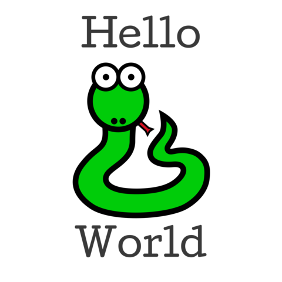

:orphan:

====================================
Tutorial 10 - Make this app your own
====================================

So far, our app has used a default "gray bee" icon. Let's personalize our
application by configuring it to use our own icon.

Adding an icon
==============

Every platform uses a different format for application icons - and some
platforms need *multiple* icons in different sizes and shapes. To account for
this, Briefcase provides a shorthand way to configure an icon once, and then
have that definition expand in to all the different icons needed for each
individual platform.

Edit your ``pyproject.toml``, adding a new ``icon`` configuration item in the
``[tool.briefcase.app.helloworld]`` configuration section, just above the
``sources`` definition::

    icon = "icons/helloworld"

This icon definition doesn't specify any file extension. The value will be used as
a prefix; each platform will add additional items to this prefix to build the files
needed for each platform.

We can now run ``briefcase update`` again - but this time, we pass in the
``--update-resources`` flag, telling Briefcase that we want to install new
application resources (i.e., the icons):

.. tabs::

  .. group-tab:: macOS

    .. code-block:: console

      (beeware-venv) $ briefcase update --update-resources

      [helloworld] Updating application code...
      Installing src/helloworld... done

      [helloworld] Updating application resources...
      Unable to find icons/helloworld.icns for application icon; using default

      [helloworld] Removing unneeded app content...
      Removing unneeded app bundle content... done

      [helloworld] Application updated.

  .. group-tab:: Linux

    .. code-block:: console

      (beeware-venv) $ briefcase update --update-resources

      [helloworld] Updating application code...
      Installing src/helloworld... done

      [helloworld] Updating application resources...
      Unable to find icons/helloworld-16.png for 16px application icon; using default
      Unable to find icons/helloworld-32.png for 32px application icon; using default
      Unable to find icons/helloworld-64.png for 64px application icon; using default
      Unable to find icons/helloworld-128.png for 128px application icon; using default
      Unable to find icons/helloworld-256.png for 256px application icon; using default
      Unable to find icons/helloworld-512.png for 512px application icon; using default

      [helloworld] Removing unneeded app content...
      Removing unneeded app bundle content... done

      [helloworld] Application updated.

  .. group-tab:: Windows

    .. code-block:: doscon

      (beeware-venv) C:\...>briefcase update --update-resources

      [helloworld] Updating application code...
      Installing src/helloworld... done

      [helloworld] Updating application resources...
      Unable to find icons/helloworld.ico for application icon; using default

      [helloworld] Removing unneeded app content...
      Removing unneeded app bundle content... done

      [helloworld] Application updated.

  .. group-tab:: Android

    .. code-block:: console

      (beeware-venv) $ briefcase update android --update-resources

      [helloworld] Updating application code...
      Installing src/helloworld... done

      [helloworld] Updating application resources...
      Unable to find icons/helloworld-round-48.png for 48px round application icon; using default
      Unable to find icons/helloworld-round-72.png for 72px round application icon; using default
      Unable to find icons/helloworld-round-96.png for 96px round application icon; using default
      Unable to find icons/helloworld-round-144.png for 144px round application icon; using default
      Unable to find icons/helloworld-round-192.png for 192px round application icon; using default
      Unable to find icons/helloworld-square-48.png for 48px square application icon; using default
      Unable to find icons/helloworld-square-72.png for 72px square application icon; using default
      Unable to find icons/helloworld-square-96.png for 96px square application icon; using default
      Unable to find icons/helloworld-square-144.png for 144px square application icon; using default
      Unable to find icons/helloworld-square-192.png for 192px square application icon; using default

      [helloworld] Removing unneeded app content...
      Removing unneeded app bundle content... done

      [helloworld] Application updated.

  .. group-tab:: iOS

    .. code-block:: console

      (beeware-venv) $ briefcase iOS --update-resources

        [helloworld] Updating application code...
        Installing src/helloworld... done

        [helloworld] Updating application resources...
        Unable to find icons/helloworld-20.png for 20px application icon; using default
        Unable to find icons/helloworld-29.png for 29px application icon; using default
        Unable to find icons/helloworld-40.png for 40px application icon; using default
        Unable to find icons/helloworld-58.png for 58px application icon; using default
        Unable to find icons/helloworld-60.png for 60px application icon; using default
        Unable to find icons/helloworld-76.png for 76px application icon; using default
        Unable to find icons/helloworld-80.png for 80px application icon; using default
        Unable to find icons/helloworld-87.png for 87px application icon; using default
        Unable to find icons/helloworld-120.png for 120px application icon; using default
        Unable to find icons/helloworld-152.png for 152px application icon; using default
        Unable to find icons/helloworld-167.png for 167px application icon; using default
        Unable to find icons/helloworld-180.png for 180px application icon; using default
        Unable to find icons/helloworld-1024.png for 1024px application icon; using default

        [helloworld] Removing unneeded app content...
        Removing unneeded app bundle content... done

        [helloworld] Application updated.

This reports the specific icon file (or files) that Briefcase is expecting.
However, as we haven't provided the actual icon files, the install fails, and
falls back to a default value (the same "gray bee" icon).

Let's provide some actual icons. Download :download:`this icons.zip bundle
<./resources/icons.zip>`, and unpack it into the root of your project
directory. After unpacking, your project directory should look something like::

    beeware-tutorial/
        beeware-venv/
            ...
        helloworld/
            ...
            pyproject.toml
            icons/
                helloworld.icns
                helloworld.ico
                helloworld.png
                helloworld-16.png
                ...
            src/
            ...

There's a *lot* of icons in this folder - but they should all look the same: a
green snake on a light blue background:

.. image:: resources/icon.png
    :align: center
    :alt: Icon of green snake with a blue background

This represents all the different icon sizes and shapes you need to support an
app on every platform that Briefcase supports.

Now that we have icons, we can update the application again. ``briefcase
update`` will only copy the updated resources into the build directory; we also
want to rebuild the app to make sure the icon takes effect. To do this, we call
``briefcase build``, passing in the same ``--update-resources`` argument:

.. tabs::

  .. group-tab:: macOS

    .. code-block:: console

      (beeware-venv) $ briefcase build --update-resources

      [helloworld] Updating application code...
      Installing src/helloworld... done

      [helloworld] Updating application resources...
      Unable to find icons/helloworld.icns for application icon; using default

      [helloworld] Removing unneeded app content...
      Removing unneeded app bundle content... done

      [helloworld] Application updated.

      [helloworld] Ad-hoc signing app...
           ━━━━━━━━━━━━━━━━━━━━━━━━━━━━━━━━━━━━━━━━━━━━━━━━━━ 100.0% • 00:01

      [helloworld] Built build/helloworld/macos/app/Hello World.app

  .. group-tab:: Linux

    .. code-block:: console

      (beeware-venv) $ briefcase build --update-resources

      [helloworld] Updating application code...
      Installing src/helloworld... done

      [helloworld] Updating application resources...
      Installing icons/helloworld-16.png as 16px application icon... done
      Installing icons/helloworld-32.png as 32px application icon... done
      Installing icons/helloworld-64.png as 64px application icon... done
      Installing icons/helloworld-128.png as 128px application icon... done
      Installing icons/helloworld-256.png as 256px application icon... done
      Installing icons/helloworld-512.png as 512px application icon... done

      [helloworld] Removing unneeded app content...
      Removing unneeded app bundle content... done

      [helloworld] Application updated.

      [helloworld] Building application...
      Build bootstrap binary...
      ...

      [helloworld] Built build/helloworld/linux/ubuntu/jammy/helloworld-0.0.1/usr/bin/helloworld

  .. group-tab:: Windows

    .. code-block:: doscon

      (beeware-venv) C:\...>briefcase build --update-resources

      [helloworld] Updating application code...
      Installing src/helloworld... done

      [helloworld] Updating application resources...
      Unable to find icons/helloworld.ico for application icon; using default

      [helloworld] Removing unneeded app content...
      Removing unneeded app bundle content... done

      [helloworld] Application updated.

      [helloworld] Building App...
      Removing any digital signatures from stub app... done
      Setting stub app details... done

      [helloworld] Built build\helloworld\windows\app\src\Hello World.exe

  .. group-tab:: Android

    .. code-block:: console

      (beeware-venv) $ briefcase build android --update-resources

      [helloworld] Updating application code...
      Installing src/helloworld... done

      [helloworld] Updating application resources...
      Installing icons/helloworld-round-48.png as 48px round application icon... done
      Installing icons/helloworld-round-72.png as 72px round application icon... done
      Installing icons/helloworld-round-96.png as 96px round application icon... done
      Installing icons/helloworld-round-144.png as 144px round application icon... done
      Installing icons/helloworld-round-192.png as 192px round application icon... done
      Installing icons/helloworld-square-48.png as 48px square application icon... done
      Installing icons/helloworld-square-72.png as 72px square application icon... done
      Installing icons/helloworld-square-96.png as 96px square application icon... done
      Installing icons/helloworld-square-144.png as 144px square application icon... done
      Installing icons/helloworld-square-192.png as 192px square application icon... done

      [helloworld] Removing unneeded app content...
      Removing unneeded app bundle content... done

      [helloworld] Application updated.

  .. group-tab:: iOS

    .. code-block:: console

      (beeware-venv) $ briefcase build iOS --update-resources

      [helloworld] Updating application code...
      Installing src/helloworld... done

      [helloworld] Updating application resources...
      Installing icons/helloworld-20.png as 20px application icon... done
      Installing icons/helloworld-29.png as 29px application icon... done
      Installing icons/helloworld-40.png as 40px application icon... done
      Installing icons/helloworld-58.png as 58px application icon... done
      Installing icons/helloworld-60.png as 60px application icon... done
      Installing icons/helloworld-76.png as 76px application icon... done
      Installing icons/helloworld-80.png as 80px application icon... done
      Installing icons/helloworld-87.png as 87px application icon... done
      Installing icons/helloworld-120.png as 120px application icon... done
      Installing icons/helloworld-152.png as 152px application icon... done
      Installing icons/helloworld-167.png as 167px application icon... done
      Installing icons/helloworld-180.png as 180px application icon... done
      Installing icons/helloworld-1024.png as 1024px application icon... done

      [helloworld] Removing unneeded app content...
      Removing unneeded app bundle content... done

      [helloworld] Application updated.

With our icons installed, we can now run our app with the new icon:

.. tabs::

  .. group-tab:: macOS

    .. code-block:: console

      (beeware-venv) $ briefcase run

      [helloworld] Starting app...

  .. group-tab:: Linux

    .. code-block:: console

      (beeware-venv) $ briefcase run

      [helloworld] Starting app...

  .. group-tab:: Windows

    .. code-block:: doscon

      (beeware-venv) C:\...>briefcase update --update-resources

      [helloworld] Updating application code...
      Installing src/helloworld... done

      [helloworld] Updating application resources...
      Unable to find icons/helloworld.ico for application icon; using default

      [helloworld] Removing unneeded app content...
      Removing unneeded app bundle content... done

      [helloworld] Application updated.

  .. group-tab:: Android

    .. code-block:: console

      (beeware-venv) $ briefcase run android

      [helloworld] Starting app...

  .. group-tab:: iOS

    .. code-block:: console

      (beeware-venv) $ briefcase run iOS

      [helloworld] Starting app...

When you start the app on a desktop platform, you might briefly notice a green
snake icon... but then the gray bee icon returns. What happened?

Well, an application really has *three* different icons:

* The icon for the app's binary;
* The icon that the app uses at runtime; and
* The icon used by the app's installation mechanism.

In most cases, these three icons will be the same - but they don't have to be.
Briefcase is able to set the first and third of these icons; however, the icon
used at runtime is determined by the GUI framework. Many GUI frameworks will
fall back to the icon in the application binary at runtime. However, in some
cases, this won't be possible; and some frameworks allow you to modify the
binary to indicate something about the application state (for example, to show
an unread indicator on the app's icon).

So - in addition to configuring Briefcase to use the new icon for the binary and
installer, we also need to provide updated icons for our app to use at runtime.

If you look in the app's ``src/helloworld/resources`` folder, you can see the
icons that are being used at runtime. We can overwrite these files with versions
from our ``icons`` folder, then update and re-run our app (using the ``-u`` flag
to update and run in a single command):

.. tabs::

  .. group-tab:: macOS

    .. code-block:: console

      (beeware-venv) $ cp icons/helloworld.icns src/helloworld/resources
      (beeware-venv) $ briefcase run -u

      [helloworld] Updating application code...
      Installing src/helloworld... done

      [helloworld] Removing unneeded app content...
      Removing unneeded app bundle content... done

      [helloworld] Application updated.

      [helloworld] Building application...
      ...

      [helloworld] Built build/helloworld/macos/app/Hello World.app

      [helloworld] Starting app...

  .. group-tab:: Linux

    .. code-block:: console

      (beeware-venv) $ cp icons/helloworld-72.png src/helloworld/resources
      (beeware-venv) $ briefcase run -u

      [helloworld] Finalizing application configuration...
      Targeting ubuntu:jammy (Vendor base debian)
      Determining glibc version... done

      Targeting glibc 2.35
      Targeting Python3.10

      [helloworld] Updating application code...
      Installing src/helloworld... done

      [helloworld] Removing unneeded app content...
      Removing unneeded app bundle content... done

      [helloworld] Application updated.

      [helloworld] Building application...
      ...

      [helloworld] Built build/helloworld/linux/ubuntu/jammy/helloworld-0.0.1/usr/bin/helloworld

      [helloworld] Starting app...

  .. group-tab:: Windows

    .. code-block:: doscon

      (beeware-venv) C:\...>copy icons\helloworld.ico src\helloworld\resources
      (beeware-venv) C:\...>briefcase run -u

      [helloworld] Updating application code...
      Installing src/helloworld... done

      [helloworld] Removing unneeded app content...
      Removing unneeded app bundle content... done

      [helloworld] Application updated.

      [helloworld] Starting app...

  .. group-tab:: Android

    This step isn't needed on Android, as mobile platforms don't have runtime
    icons.

  .. group-tab:: iOS

    This step isn't needed on iOS, as mobile platforms don't have runtime
    icons.

This time, when the app runs, you should see the new green snake icon.

Splash screens
==============

Mobile platforms have an additional customization option in addition to icons -
they have a splash screen. Let's replace the default "Made with BeeWare" splash
screen with something custom.

Edit your ``pyproject.toml``, adding a new ``splash`` configuration item in the
``[tool.briefcase.app.helloworld]`` configuration section, just after the
``icon`` definition::

    splash = "splash/helloworld"

As before, this configures a filename prefix; each platform will add to this
prefix to generate the final filenames. Download :download:`this splash.zip bundle
<./resources/splash.zip>`, and unpack it into the root of your project
directory to provide the splash images. The splash images are large, square
images with a transparent background, in a range of sizes.

Again, there's a lot of images, representing all the sizes required to provide
splash screens for Android and iOS - but they should all look the same: a green
snake with the text "Hello world":

We can then re-run the app, forcing a resource update to ensure the new splash
images are copied in the app, and the app is re-built before being started:

.. tabs::

  .. group-tab:: macOS

     This step isn't required on macOS, as macOS apps don't have splash screens.

  .. group-tab:: Linux

     This step isn't required on Linux, as Linux apps don't have splash screens.

  .. group-tab:: Windows

     This step isn't required on Windows, as Windows apps don't have splash screens.

  .. group-tab:: Android

    .. code-block:: console

      (beeware-venv) $ briefcase run android --update-resources

      [helloworld] Updating application code...
      Installing src/helloworld... done

      [helloworld] Updating application resources...
      Installing icons/helloworld-round-48.png as 48px round application icon... done
      Installing icons/helloworld-round-72.png as 72px round application icon... done
      Installing icons/helloworld-round-96.png as 96px round application icon... done
      Installing icons/helloworld-round-144.png as 144px round application icon... done
      Installing icons/helloworld-round-192.png as 192px round application icon... done
      Installing icons/helloworld-square-48.png as 48px square application icon... done
      Installing icons/helloworld-square-72.png as 72px square application icon... done
      Installing icons/helloworld-square-96.png as 96px square application icon... done
      Installing icons/helloworld-square-144.png as 144px square application icon... done
      Installing icons/helloworld-square-192.png as 192px square application icon... done
      Installing splash/helloworld-normal-320.png as 320px normal splash image... done
      Installing splash/helloworld-normal-480.png as 480px normal splash image... done
      Installing splash/helloworld-normal-640.png as 640px normal splash image... done
      Installing splash/helloworld-normal-960.png as 960px normal splash image... done
      Installing splash/helloworld-normal-1280.png as 1280px normal splash image... done
      Installing splash/helloworld-large-480.png as 480px large splash image... done
      Installing splash/helloworld-large-720.png as 720px large splash image... done
      Installing splash/helloworld-large-960.png as 960px large splash image... done
      Installing splash/helloworld-large-1440.png as 1440px large splash image... done
      Installing splash/helloworld-large-1920.png as 1920px large splash image... done
      Installing splash/helloworld-xlarge-720.png as 720px xlarge splash image... done
      Installing splash/helloworld-xlarge-1080.png as 1080px xlarge splash image... done
      Installing splash/helloworld-xlarge-1440.png as 1440px xlarge splash image... done
      Installing splash/helloworld-xlarge-2160.png as 2160px xlarge splash image... done
      Installing splash/helloworld-xlarge-2880.png as 2880px xlarge splash image... done

      [helloworld] Removing unneeded app content...
      Removing unneeded app bundle content... done

      [helloworld] Application updated.

      [helloworld] Updating app metadata...
      Setting main module... done

      [helloworld] Building Android APK...
      ...
      Building... done

      [helloworld] Built build/helloworld/android/gradle/app/build/outputs/apk/debug/app-debug.apk

      [helloworld] Starting app...

  .. group-tab:: iOS

    .. code-block:: console

      (beeware-venv) $ briefcase build iOS --update-resources

      [helloworld] Updating application code...
      Installing src/helloworld... done

      [helloworld] Updating application resources...
      Installing icons/helloworld-20.png as 20px application icon... done
      Installing icons/helloworld-29.png as 29px application icon... done
      Installing icons/helloworld-40.png as 40px application icon... done
      Installing icons/helloworld-58.png as 58px application icon... done
      Installing icons/helloworld-60.png as 60px application icon... done
      Installing icons/helloworld-76.png as 76px application icon... done
      Installing icons/helloworld-80.png as 80px application icon... done
      Installing icons/helloworld-87.png as 87px application icon... done
      Installing icons/helloworld-120.png as 120px application icon... done
      Installing icons/helloworld-152.png as 152px application icon... done
      Installing icons/helloworld-167.png as 167px application icon... done
      Installing icons/helloworld-180.png as 180px application icon... done
      Installing icons/helloworld-1024.png as 1024px application icon... done
      Installing splash/helloworld-800.png as 800px splash image... done
      Installing splash/helloworld-1600.png as 1600px splash image... done
      Installing splash/helloworld-2400.png as 2400px splash image... done

      [helloworld] Removing unneeded app content...
      Removing unneeded app bundle content... done

      [helloworld] Application updated.

      [helloworld] Updating app metadata...
      Setting main module... done

      [helloworld] Building Xcode project...
      Building... done

      [helloworld] Built build/helloworld/ios/xcode/build/Debug-iphonesimulator/Hello World.app

      [helloworld] Starting app...

We now have a fully customized app!

Next steps
==========

This has been a taste for what you can do with the tools provided by the
BeeWare project. What you do from here is up to you!

Some places to go from here:

* Tutorials demonstrating `features of the Toga widget toolkit
  <https://toga.readthedocs.io/en/latest/tutorial/index.html>`__.
* Details on the `options available when configuring your Briefcase project
  <https://briefcase.readthedocs.io/en/latest/reference/index.html>`__.

.. We've now got an application with a custom icon on our desktop and phone! How do
.. we share this application with everyone else? Turn to :doc:`Tutorial 11
.. <tutorial-11>` to find out...
