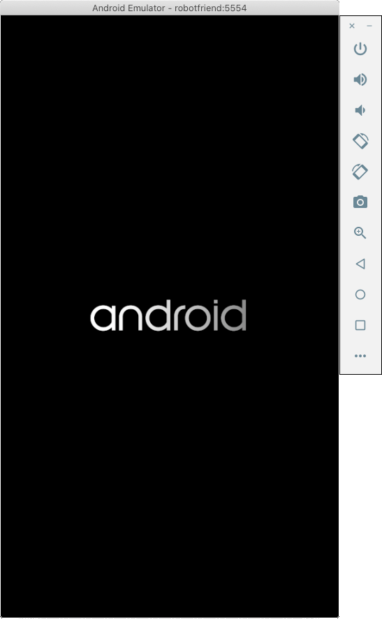
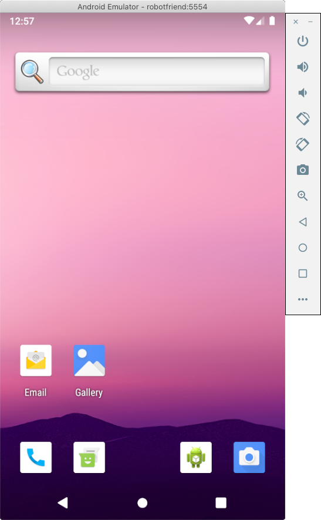

======================================
Tutorial 5 - Taking it mobile: Android
======================================

The process of deploying an application to Android is very similar to the
process for deploying as a desktop application. The ``briefcase`` tool
handles the installation of dependencies for Android, including the
Android SDK, the Android emulator, and the AdoptOpenJDK Java compiler and
runtime.

Create an Android app and compile it
====================================

Firs, run the ``create`` command. This downloads an Android app template and
adds your Python code to it.

.. tabs::

  .. group-tab:: macOS

    .. code-block:: bash

      (beeware-venv) $ briefcase create android

      [helloworld] Generating application template...
      Using app template: https://github.com/beeware/briefcase-android-gradle-template.git
      ...
      [helloworld] Installing support package...
      ...
      [helloworld] Installing dependencies...
      ...
      [helloworld] Installing application code...
      ...
      [helloworld] Installing application resources...
      ...
      [helloworld] Application created.

  .. group-tab:: Linux

    .. code-block:: bash

      (beeware-venv) $ briefcase create android

      [helloworld] Generating application template...
      Using app template: https://github.com/beeware/briefcase-android-gradle-template.git
      ...
      [helloworld] Installing support package...
      ...
      [helloworld] Installing dependencies...
      ...
      [helloworld] Installing application code...
      ...
      [helloworld] Installing application resources...
      ...
      [helloworld] Application created.

  .. group-tab:: Windows

    .. code-block:: doscon

      (beeware-venv) C:\...>briefcase create android

      [helloworld] Generating application template...
      Using app template: https://github.com/beeware/briefcase-android-gradle-template.git
      ...
      [helloworld] Installing support package...
      ...
      [helloworld] Installing dependencies...
      ...
      [helloworld] Installing application code...
      ...
      [helloworld] Installing application resources...
      ...
      [helloworld] Application created.

Once this completes, we'll now have an ``android`` directory in your project.
This directory will contain a ``Hello World`` folder, which will contain an
Android project with a Gradle build configuration. This project will contain
your application code, and a support package containing the Python interpreter
and the `rubicon-java` library.

In the process, Briefcase downloads the Android SDK. You may be prompted to
accept Google's Android SDK license.

You can then use Briefcase's ``build`` command to compile this into an Android
APK app file. It will take quite a few minutes the first time, depending on
your Internet connection speed, and then should take less than 30 seconds every
successive time.

.. admonition:: Gradle can look stuck

  You may see Gradle stuck on the "CONFIGURING" step for many, many minutes.
  Gradle is likely busy performing downloads, and you should not interrupt it.
  This typically only affects the first time an app is built.

.. code-block:: bash

  (beeware-venv) $ briefcase build android
  [helloworld] Building Android APK...
  Starting a Gradle Daemon
  ...
  BUILD SUCCESSFUL in 1m 1s
  28 actionable tasks: 17 executed, 11 up-to-date
  [helloworld] Built android/Hello World/app/build/outputs/apk/debug/app-debug.apk

Run the app on a virtual device
===============================

We're now ready to run our application. You can use Briefcase's ``run`` command
to run the app on an Android device, either physical or virtual. This section
covers running the app on a virtual Android device.

On Android, Briefcase's ``run`` command requires that you specify which device to run on.
If you use ``run`` without specifying a device, Briefcase will show a list of
physical and virtual devices (if any) and offer to create one.

.. tabs::

  .. group-tab:: macOS

    .. code-block:: bash

      (beeware-venv) $ briefcase run android

      Select device:

        1) Create a new Android emulator

      >

  .. group-tab:: Linux

    .. code-block:: bash

      (beeware-venv) $ briefcase run android

      Select device:

        1) Create a new Android emulator

      >

  .. group-tab:: Windows

    .. code-block:: doscon

      (beeware-venv) C:\...>briefcase run android

      Select device:

        1) Create a new Android emulator

      >

Choose your desired device, or choose the option to create a new device. If you create a new
device, you will have to provide a name (or accept the default of ``beePhone``).

Once you choose a device, you will see two steps of Android booting followed by your app
launching. First, the Android logo will appear.

   Android virtual device booting

In the second phase, the launcher screen will appear.

   Android virtual device fully started, on the launcher screen

Once the phone finishes booting, ``briefcase run`` will automatically begin
to launch your app. You will first see a splash screen, then your app. If you
see an error message in your console, you may need to follow the advice in the
error message about finding the correct device name.

Run the app on a physical device
================================

If you have an Android phone or tablet you want to run your app on, you can
connect it to your development workstation, typically using a USB cable.
Then you can use Briefcase's ``run`` command to target your physical device.

If Briefcase can detect the device, it will appear in the ``run`` output.

.. tabs::

  .. group-tab:: macOS

    .. code-block:: bash

      (beeware-venv) $ briefcase run android

      Select device:

        1) CoolPhone
        2) Create a new Android emulator

      >

  .. group-tab:: Linux

    .. code-block:: bash

      (beeware-venv) $ briefcase run android

      Select device:

        1) CoolPhone
        2) Create a new Android emulator

      >

  .. group-tab:: Windows

    .. code-block:: doscon

      Select device:

        1) CoolPhone
        2) Create a new Android emulator

      >

In this example, you could type **1** then press return to run the app on your
CoolPhone device. In the case that your device is detected, but the Android
tools cannot install apps over the USB connection, Briefcase will print a
message explaining how to enable USB debugging.

If you wish to skip the prompt in the future, you can pass the ``-d device_name``
parameter. Upon successfully selecting the device, Briefcase will print the
specific device name to pass to ``-d``.

Next steps
==========

We've now got an application on our phone! Is there anywhere other way to
deploy a BeeWare app? Turn to :doc:`Tutorial 6 <../tutorial-6>` to find
out...
