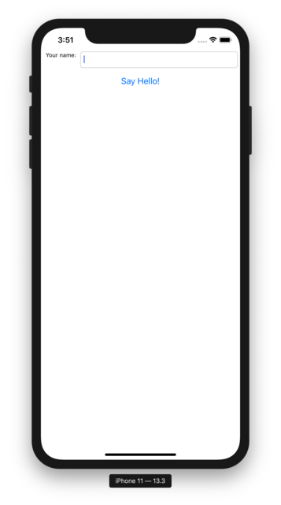

==================================
Tutorial 5 - Taking it mobile: iOS
==================================

Now, we're going to take our application, and deploy it as an iOS application.

The process of deploying an application to iOS is very similar to the process
for deploying as a desktop application. First, you run the ``create`` command -
but this time, we specify that we want to create an iOS application:

.. code-block:: bash

  (beeware-venv) $ briefcase create iOS

  [helloworld] Generating application template...
  Using app template: https://github.com/beeware/briefcase-iOS-app-template.git
  ...
  [helloworld] Installing support package...
  ...
  [helloworld] Installing dependencies...
  ...
  [helloworld] Installing application code...
  ...
  [helloworld] Installing application resources...
  ...
  [helloworld] Application created.

Once this completes, we'll now have an ``iOS`` directory in your project.
This directory will contain a ``Hello World`` folder, which will contain
an Xcode project, as well as the support libraries and the application code
needed for the application.

You can then use Briefcase to compile your app using
the ``build`` command. You'll be prompted to select a device to compile for; if
you've got simulators for multiple iOS versions installed, you may also be
asked which iOS version you want to target. The options you are shown may
differ from the options show in this output; for our purposes, it doesn't
matter which simulator you pick.

.. code-block:: bash

  (beeware-venv) $ briefcase build iOS

  Select iOS version:

    1) 10.3
    2) 13.3

  > 2

  Select simulator device:

    1) iPad (7th generation)
    2) iPad Air (3rd generation)
    3) iPad Pro (11-inch)
    4) iPad Pro (12.9-inch) (3rd generation)
    5) iPad Pro (9.7-inch)
    6) iPhone 11
    7) iPhone 11 Pro
    8) iPhone 11 Pro Max
    9) iPhone 8
    10) iPhone 8 Plus

  >  6

  Targeting an iPhone 11 running iOS 13.3 (device UDID 4768AA69-497B-4B37-BD0C-3961756C38AC)

  [hello-world] Building XCode project...
  ...
  Build succeeded.

  [hello-world] Built iOS/Hello World/build/Debug-iphonesimulator/Hello World.app

We're now ready to run our application. You could do this by running
``briefcase run iOS``. If you run briefcase in that way, you'll be asked again
for the device you want to target. If you already know the devices that are
available, you can tell briefcase to use that simulator by providing a ``-d``
(or ``--device``) option. Using the name of the device you selected when
you built your application, run::

    $ briefcase run iOS -d "iPhone 11"

If you have multiple iPhone 11 simulators, briefcase will pick the highest
iOS version; if you want to pick a particular iOS version, you tell it to use
that specific version::

    $ briefcase run iOS -d "iPhone 11::13.3"

Or, you can name a specific device UDID::

    $ briefcase run iOS -d 4768AA69-497B-4B37-BD0C-3961756C38AC

This will start the iOS simulator, install your app, and start it. You should
see the simulator start, and eventually open your iOS application:

Next steps
==========

We've now got an application on our phone! Is there anywhere other way to
deploy a BeeWare app? Turn to :doc:`Tutorial 6 <../tutorial-6>` to find
out...
