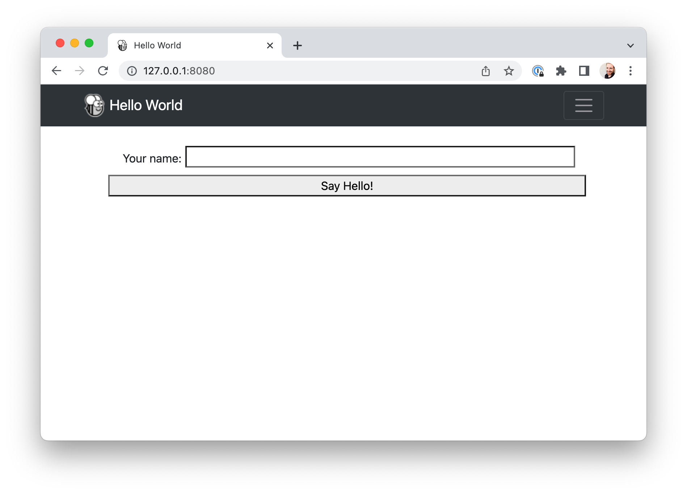

===============================
Tutorial 6 - Put it on the web!
===============================

In addition to supporting mobile platforms, the Toga widget toolkit also
supports the web! Using the same API that you used to deploy your desktop and
mobile applications, you can deploy your application as a single-page web app.

.. admonition:: Proof of Concept

    The Toga Web backend is the least mature of all the Toga backends. It's
    mature enough to show off a few features, but it's missing many other
    widgets. At this point in time, Web deployment should be considered a "Proof
    of Concept" - enough to demonstrate what can be done, but not enough to be
    relied on for serious development.

Deploying as a web app
======================

The process of deploying as a single-page web app follows the same familiar
pattern - you create the application, then build the application, then run it.
However, Briefcase can be a little bit smart; if you attempt to run an
application, and Briefcase determines that it hasn't been created or built for
the platform being targeted, it will do the create and build steps for you.
Since this is our first time running the app for the web, we can perform all
three steps with one command:

.. tabs::

  .. group-tab:: macOS

    .. code-block:: console

      (beeware-venv) $ briefcase run web

      [helloworld] Generating application template...
      ...
      [helloworld] Created web/static/Hello World

      [helloworld] Building web project...
      ...
      [helloworld] Built web/static/Hello World/www/index.html

      [helloworld] Starting web server...
      Web server open on http://127.0.0.1:8080

      [helloworld] Web server log output (type CTRL-C to stop log)...
      ===========================================================================

  .. group-tab:: Linux

    .. code-block:: console

      (beeware-venv) $ briefcase run web

      [helloworld] Generating application template...
      ...
      [helloworld] Created web/static/Hello World

      [helloworld] Building web project...
      ...
      [helloworld] Built web/static/Hello World/www/index.html

      [helloworld] Starting web server...
      Web server open on http://127.0.0.1:8080

      [helloworld] Web server log output (type CTRL-C to stop log)...
      ===========================================================================

  .. group-tab:: Windows

    .. code-block:: doscon

      (beeware-venv)C:\...>briefcase run web

      [helloworld] Generating application template...
      ...
      [helloworld] Created web/static/Hello World

      [helloworld] Building web project...
      ...
      [helloworld] Built web/static/Hello World/www/index.html

      [helloworld] Starting web server...
      Web server open on http://127.0.0.1:8080

      [helloworld] Web server log output (type CTRL-C to stop log)...
      ===========================================================================

This will open a web browser, pointing at `http://127.0.0.1:8080
<http://127.0.0.1:8080>`__:

If you enter your name and click the button, a dialog will appear.

How does this work?
===================

This web app is a static website - a single HTML source page, with some CSS and
other resources. Briefcase has started a local web server to serve this page so
your browser can view the page. If you wanted to put this webpage into
production, you could copy the contents of the ``www`` folder onto any web
server that can serve static content.

But when you press the button, you're running Python code... how does that work?
Toga uses `PyScript <https://pyscript.net>`__ to provide a Python interpreter in
the browser. Briefcase packages your app's code as wheels that PyScript can load
in the browser. When the page is loaded, the application code runs in the
browser, building the UI using the browser DOM. When you click a button, that
button runs the event handling code in the browser.

Next steps
==========

Although we've now deployed this app on desktop, mobile and the web, the app is
fairly simple, and doesn't involve any third-party libraries. Can we include
libraries from the Python Package Index (PyPI) in our app? Turn to
:doc:`Tutorial 7 <tutorial-7>` to find out...
